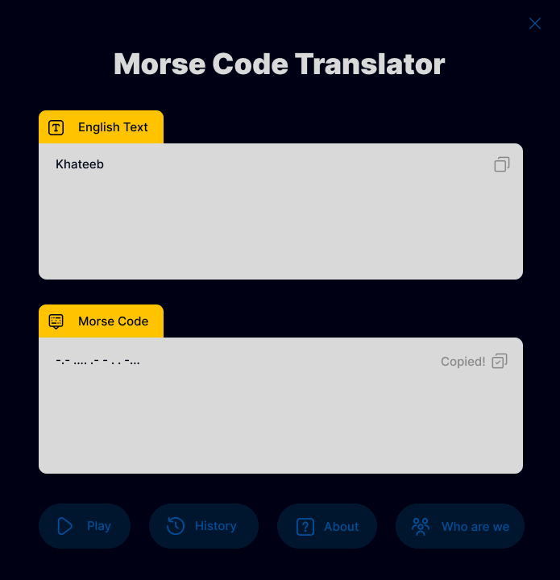

# Morse Code Translator

This is a Windows Forms application that can translate text to Morse code and vice versa.

## Requirements

- .NET Framework 4.5.2
- MySQL Connector for database (included)

## Installation

1. Create a **MySQL** database with the name `morse_code_translator`
2. The `morse_code_translator` should include the table `history` with the following columns:
    - id (int)
    - englishText (varchar)
    - morseCodeText (varchar)
    - date (date)
    - time (time)
3. Run your localhost server (XAMPP, WAMPP, etc).
4. Now, the application should work properly.